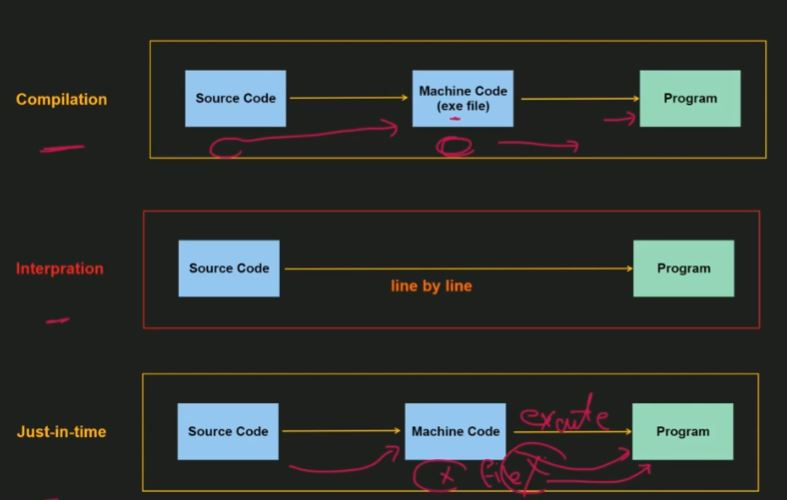
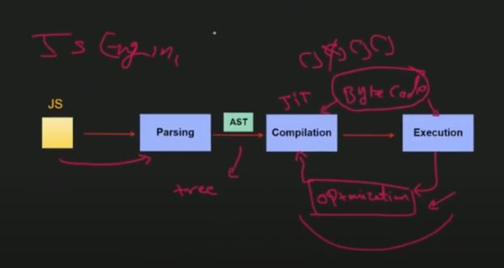
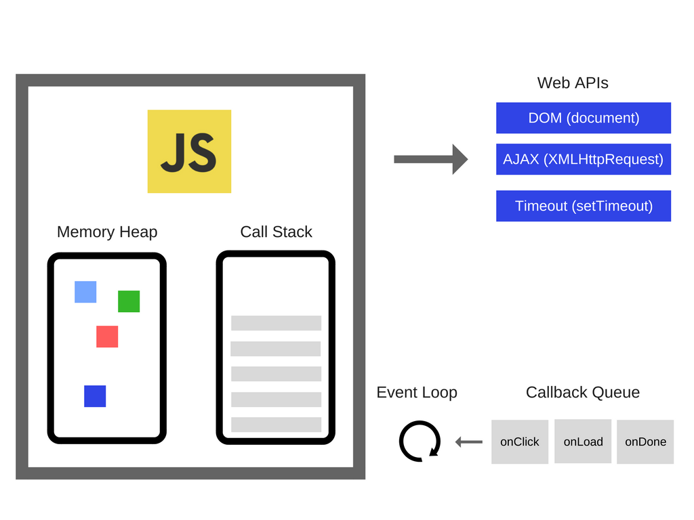
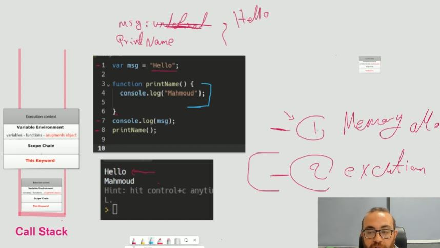

### Complete JS guide

#### 1-Introduction section

- What is the JS?

- How does the web page work?

- JS in Action?

- how is js executed?

- what this means Dynamic ? Weekly Typed?

- JS runs on a host environment
  google's javescript engine without browser(v8) = nodejs

- V8 takes the JavaScript code, compiles it into machine code, and then executes it. This process allows Node.js to run JavaScript efficiently on the server side, just as V8 allows for fast execution of JavaScript in the browser.

- what is course content
- how to get the most out of the course?

- javascript vs java
- client side (Browser) vs server side (Nodejs)
- Why Browser-side first?

- Abrif history of js history?

- ECMAScript vs JavaScript
- ECMA is standards organization
  js is the most famous ECMAScript implementation(others would be action script or jscript)

##### from js under the hoood

### JIT



- Garbag Collector
- any variable should deleted after creation else memory leak causes
- languages that has garbage collector resposible of
  deleting variables after creation instead of you
- but what if don't understand this concept also may causes memory even if your language has garbage collector

```c
// example
function memLeak(){
	this.var = "my name is ahmed"
}
```

JIT or just in time compiler

Compilation vs Interpration vs Just-In-Time

in compilation: user runs executable file (.exe)
in interpration: program execute automatically
in just in time: source code converted to machine code and just in time execute the program

JavaScript now is just in time language not interpreted language

### JS is prototype based Language

- js is multiple paradigm language (procedure, OOP, functional )
- paradigm like a mind set of the programming way(writing code)

- js is prototype OOP based language Not Classical OOP Language
- there is no class is a prototype object
- that means the relation between child object and parent object can changed in runtime
- relation can be for example method inherited from the parent class
  - even child class can change its parent class in runtime(but Not Recommended)

#### First Class Function

- pass function as a argument to another function
- in other words means pointer to function

```js
function handleClick(){
	console.log("Button Clicked);
}
const btn = document.querySelector("#mybutton");
btn.addEventListener("click", ChandleClick);
```

```js
function sayHello() {
  console.log("hello");
}
const greet = sayHello();
```

### What is the JS Engine?


is a software component inside browser that builds or compiler js source code into machine code
there are several js engines such as ()
most famous js engine is V8 (Google Chrome's js engine)

very browser has its own JavaScript engine. Google Chrome has the V8 engine, Mozilla Firefox has SpiderMonkey, and so on. They all are used for the same goal, because the browsers cannot directly understand JavaScript code.

- V8 engine is a open source
- v8 is the js engine inside (chrome, edge, nodejs)

AST is a tree Data structure

[AST explorer](https://astexplorer.net/)

#### inside js engine



#### call stack js engine

item or element is called execution context (like function call)
and first execution context in call stack is global or anonymous execution context


#### Execution context



- Execution context consists of 3 sections:

  - Variable environment(variables - functions - `arguments object`)
  - scope chain
  - `This keyword`

- note: execution context of the arrow functions doesn't conatin: argument object and This keyword

- **2 phases** to perform each execution context
  1. memory allocation or creation (just allocate size to variable and functions)
  2. execution(assign values to variables and execute the functions call)

```c
console.log(name);
var name = "ahmed";
```

```
// global execution context
phase 1: memory allocation
  allocate memory or save to log function
  allocate memory or save to name with undefined value
phase 2: execution
  execute log function -> undefined
  execute name variable -> assign "ahmed" value
```

#### Hositing

you can use a variable before creation (without undefined error)

```js
// example var hoisting
console.log(msg); // compiled but value will be undefined
var msg = "hello";
```

```js
// example function hoisting
printHello(); // compiled

function printHello() {
  console.log("hello");
}
```

```js
// example let or const hoisting
console.log(msg);
// error to prevent this hositing feature,
// can't access xx before initialozation
let msg = "hello";
// but also msg here stored in the environment section in execution context in dead section
```

```js
// example arrow function hoisting
console.log(double_f(5));
// undefined error (for var)
// ReferenceError: can't access x before initialization (for let)
let double_f = (num) => num * 2;
```

```js
// more examples and guess the output
console.log(example);
var example = "variable";
console.log(example);
function example() {
  console.log("Function");
}
```

```js
// more examples and guess the output
// console.log(motherBird); // print function type

console.log(motherBird()); // call function

function motherBird() {
  function babyBird() {
    return "Tweet Tweet!";
  }
  return babyBird();

  function babyBird() {
    return "chirp chirp!";
  }
}
```

#### Argument Object

in variable environment in execution context

```js
function add(arg1, arg2) {
  console.log(arguments);
}
add(2, 3);
add(2, "ahmed");
// here a argument object consist of key and value created automatically
// remeber!: NOT Generated in arrow functions
```

```js
// ReferenceError; arguments is not defined
const arrowfun = (arg1, arg2) => {
  console.log(arguments);
};
arrowfun(2, 3);
// remeber!: NOT Generated in arrow functions
```

#### Rest Parameters

```js
// convert argumentObject to array
// use arguments keyword
function sum() {
  let total = 0;

  let arr = Array.from(arguments);
  for (let item of arr) {
    total += item;
  }
  return total;
}
```

- Use rest parameters,

```js
// use arguments keyword
function sum(...argsObj) {
  let total = 0;
  for (let item of argsObj) {
    total += item;
  }
  return total;
}
sum(1, 2, 3, 8); // 14
```

- default parameters doesn't include in arguments

```js
// with default parameter
function sum(a, b, c = 2) {
  console.log(arguments);
}
sum(1, 2, 3);
```

- arguments order

```js
// with default parameter
function teacher(...params) {
  console.log(`teacher name is ${params[1]} and his age is ${params[0]}`);
}
teacher(23, "ahmed");
teacher("ahmed", 23);
```

- arguments tips
- always use rest parameters(...)

---

### 02_Basic Module

- module introduction
- setup the project
- git
- git resources
  [Git get started](https://academind.com/tutorials/git-the-basics)
  [Github Get started](https://academind.com/tutorials/github-the-basics)
- [git official doc](https://git-scm.com/about/branching-and-merging)

- Adding js to website
  1- adding code between script tag in index.html file
  2- import external script.js

- variables and constants

```js
let userName = "Ahmed";
userName = "mohamed";
const totalUsers = 15;
// totalUsers = 20; // can't change
```

- declaring variables
- variable naming

  - Allowed
    - camelCase is recommended in js
  - Not Allowed/ Not Recommended
    - start with numbers

- working with variables & operators

  - `+, -, *,/, %, **` , `=, +=, -=,..` , `++, --`

- Data types

  - ``, '' , ""

- Functions
